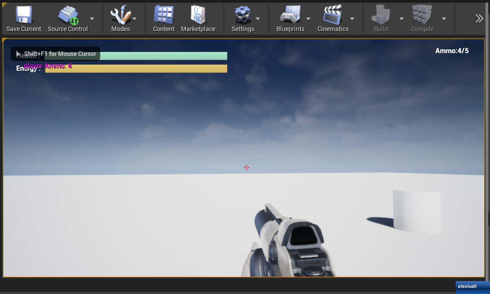

# FPSTemplate

版本：Unreal Engine 4.27.2

虚幻4 的一个学习用项目，会集成一些目前UE 官方文档 上的教程

## 使用UMG的用户界面

使用UMG创建简易的菜单系统 [链接](https://docs.unrealengine.com/4.27/zh-CN/ProgrammingAndScripting/ProgrammingWithCPP/CPPTutorials/UMG/)

## UMG UI设计器快速入门

虚幻引擎4中的虚幻示意图形使用入门。

[链接](https://docs.unrealengine.com/4.27/zh-CN/InteractiveExperiences/UMG/QuickStart/)

这个 Level 在 ./FPSTemplate/Content/MyLevel/FPS_Level.umapMyLevel 目录下

